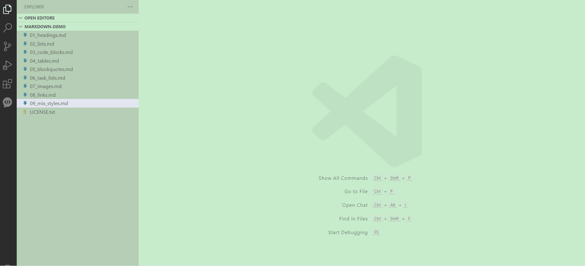

# markdown-auto-preview

Tired of manually opening the Markdown preview with Ctrl+K V or ⌘+K V every time? This extension automatically opens the preview when you open a .md file — no extra steps needed. Ideal for anyone who works with Markdown regularly and wants a smoother editing experience.